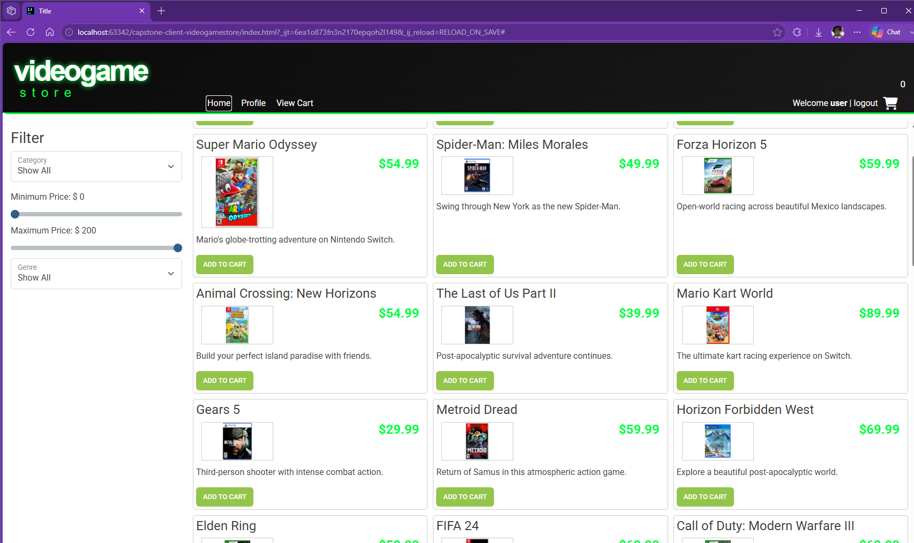
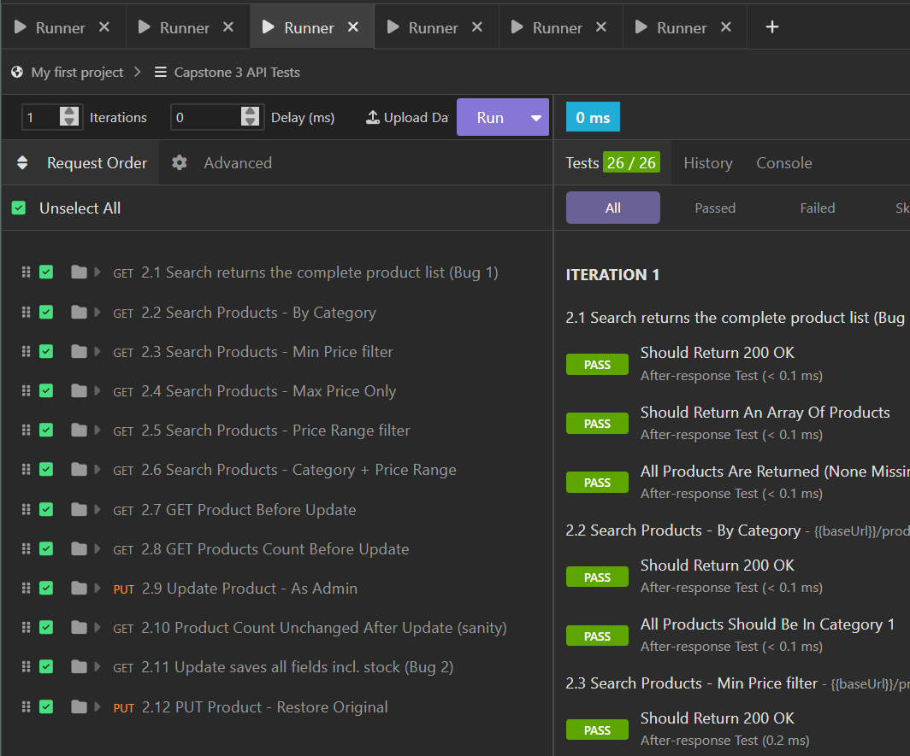
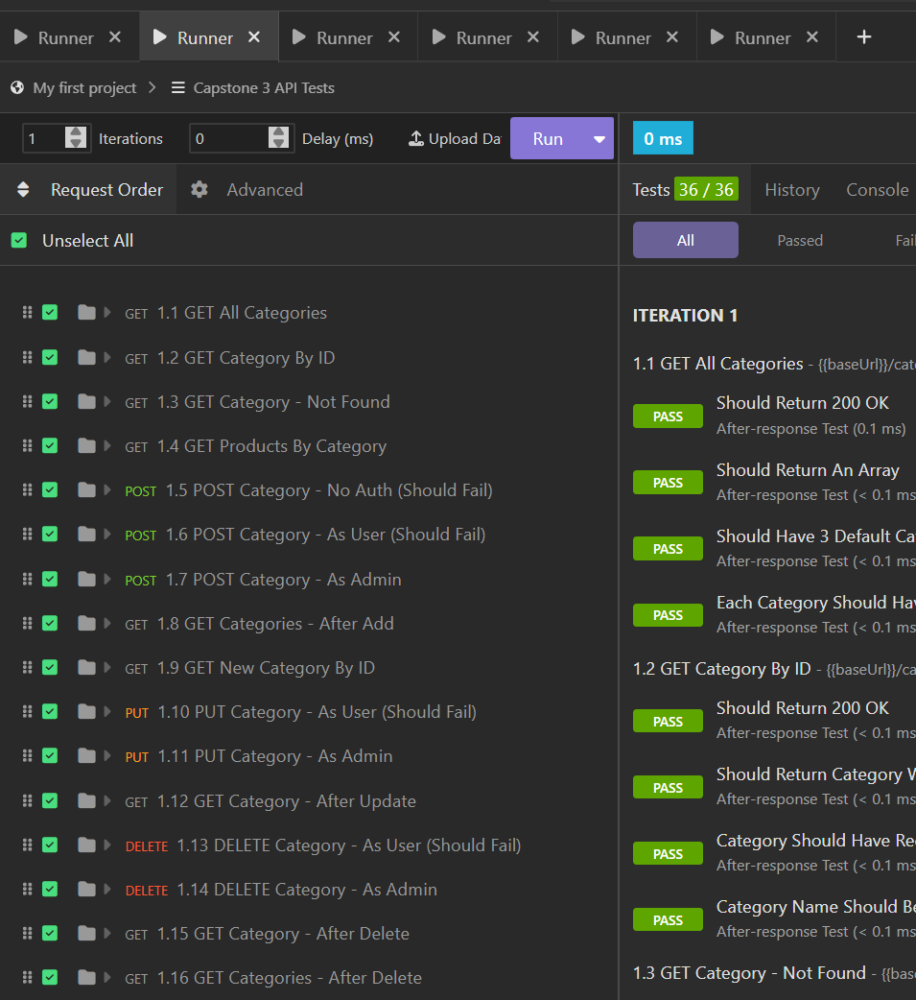
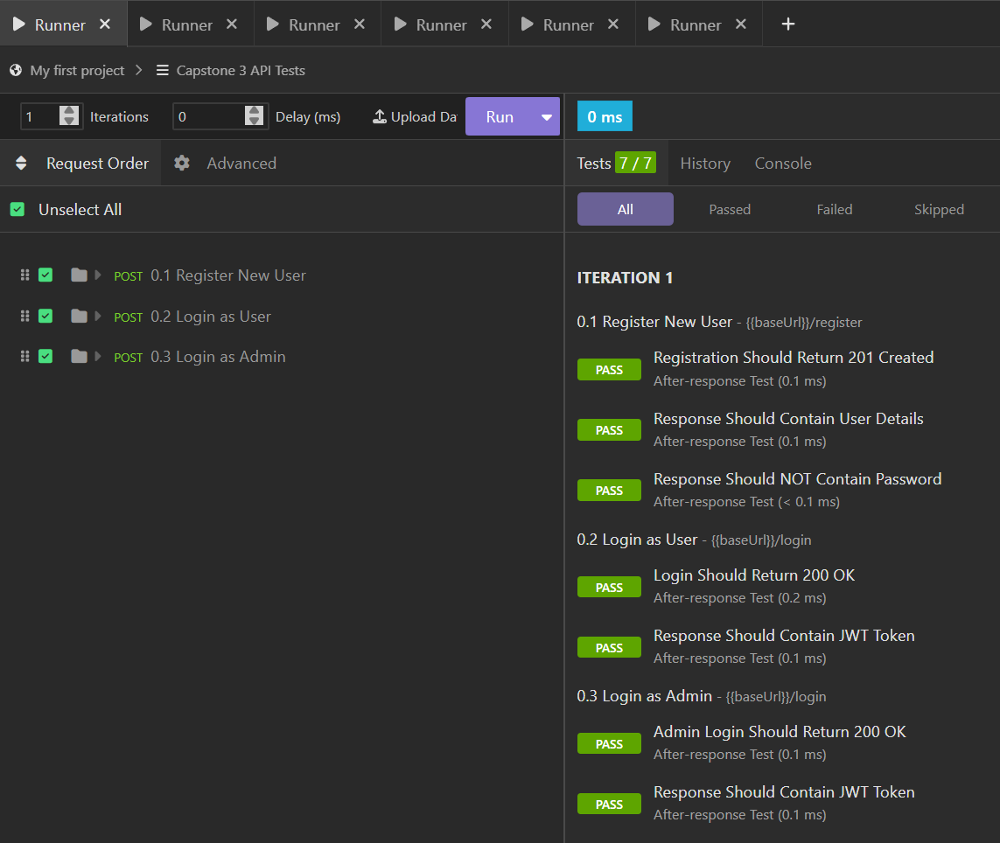
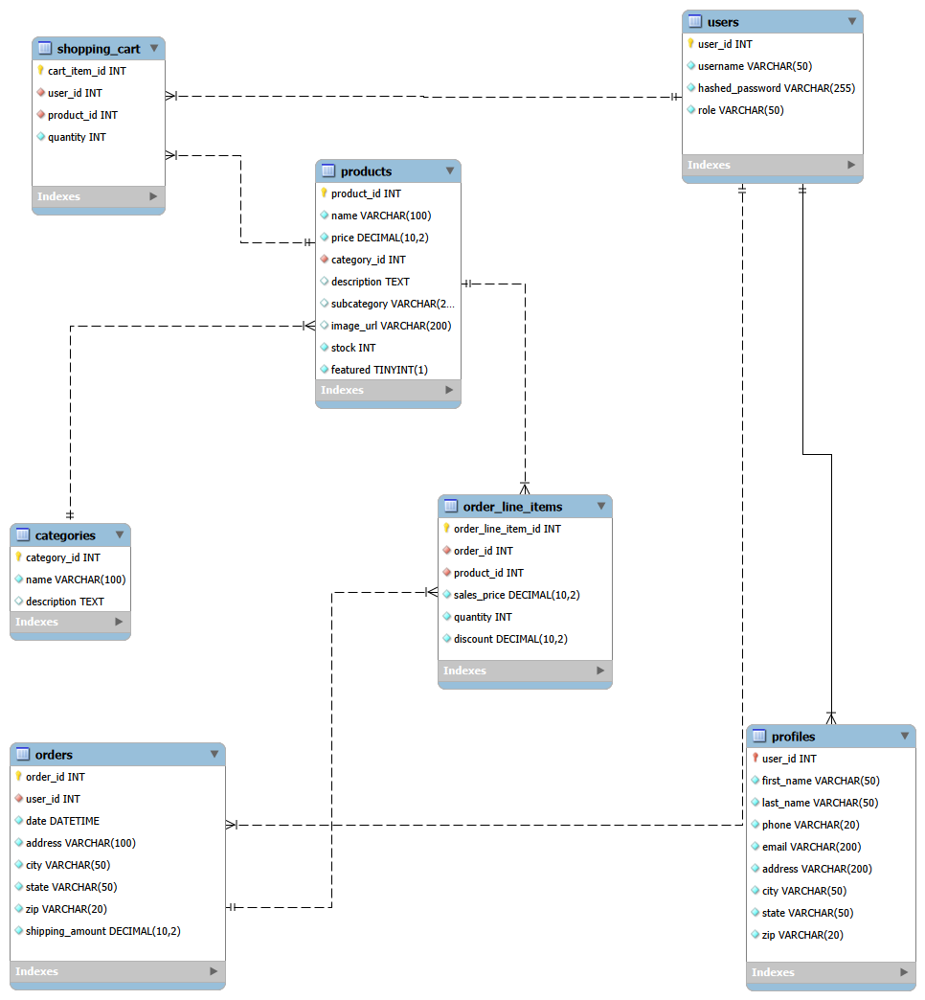

# Geeked Gamers Shop

Capstone 3 is an e-commerce application for an online video game store.
I was provided with a folder containing the API and frontend website and tasked with completing 5 phases. 

### Phases
1 - CategoriesController ✅

2 - Fix Bugs ✅

3 - Shopping Cart ✅

4 - User Profile ✅

5 - Checkout 🚧

---------

A GitHub Project board was created to manage the workload and a trail of commit histories was created to track progress and the process of changes. 
Frontend changes were not required and required a seperate repository. Only a minor spelling error was addressed.

## Interesting Code

-- For my interesting piece of code, I chose the @PreAuthorize annotation since there were multiple instances where not having this cause the code to malfunction. And this is because even though your query would be sent to MySQL, without the security code the injection points
 wouldn't work. IntelliJ sees the tokens coming back but doesn't recognize it, which would stop it from continuing due to Spring relying on Aspect Oriented Programming (AOP). 
-- The other reason I found it interesting is that I ended up discovering that there were two different ways to handle it. You could either clear the whole class at the top or authorize individual methods within the class. And while both work, they were just for different use case scenarios. 

## Screenshots
These are simply some screenshots to exhibit that the front end loads and the required two phases passes inspection.

## Entity Related Diagram (ERD)

----------
## AI Use

AI was used during this assignmen and tags will be added along with what exactly it did. Though for the most (~95%) part AI was not used during the assignment. 
---------
Link to Front-End Repo (Required to access FrontEnd): https://github.com/Joy-ConScion/GeekedGamerShop-FrontEnd
